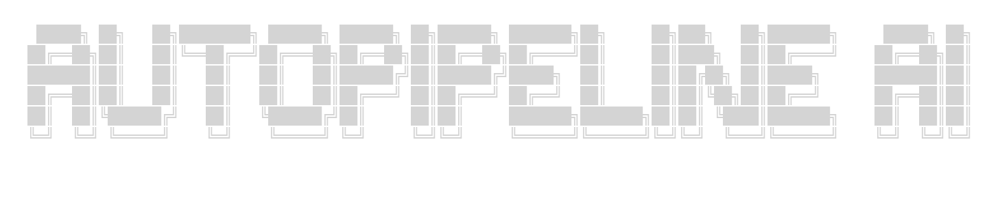

  <!-- Replace the src attribute with the path to your rectangular logo image -->
  

# Auto-Pipeline-AI

Welcome to the **Auto-Pipeline-AI** organization! We are dedicated to revolutionizing CI/CD workflows by harnessing the power of Artificial Intelligence. Our suite of tools automates the generation and management of CI/CD pipelines, making DevOps faster, more secure, and highly adaptable.

## 🌟 Our Mission

To empower developers and DevOps teams by automating CI/CD workflow generation using AI agents, reducing manual configuration overhead, and ensuring best practices across all projects.

## ✨ Key Features

- **🤖 Automated CI/CD Generation:** Create complete CI/CD workflows using AI agents.
- **🌐 Universal Support:** Automatically support multiple languages and frameworks.
- **🧠 Provider-Agnostic AI:** Works seamlessly with any LLM of your choice.
- **✅ Workflow Validation:** Validate generated workflows for correctness and safety before saving.
- **🔌 API-First Design:** Exposed via API for easy integration with external systems.
- **🔒 Secure by Design:** Runs locally by default. User choice ensures it doesn't read or store any sensitive credentials.
- **🛠️ Multi-Platform Support:** Integrates with different Git clients and CI providers, including GitHub, GitLab, Jenkins, and more.

## 🏗️ Organization Repositories

Our organization is structured into three primary repositories, separating concerns and making contribution easier:

### 1. 🖥️ Front-End
The user interface for interacting with our AI pipeline generator.
- Provides a seamless, intuitive experience for developers to prompt the AI and visualize generated pipelines.
- Interfaces with the Backend API to handle configuration, LLM selection, and workflow validation.

### 2. ⚙️ Back-End
The core engine that powers the application and serves the API.
- Handles API requests, and integration with external systems.
- Coordinates between the Frontend, the AI Agent, and external version control systems (GitHub, GitLab, Jenkins).

### 3. 🧠 Agent
The standalone AI agent responsible for the heavy lifting.
- Analyzes project structures and requirements to automatically construct pipelines.
- Supports provider-agnostic LLM connections (local or cloud-based).
- Contains the validation logic to ensure every generated workflow is safe, syntactically correct, and secure.

## 🤝 Getting Involved

Whether you want to use Auto-Pipeline-AI in your organization or contribute to the source code, we welcome you! 

- Check out the individual repositories for specific setup and contribution guidelines.
- Remember: Security and user control are our top priorities. You maintain full control over where your AI agents run and how your credentials are managed.

---

*Built with ❤️ to make CI/CD pipelines effortless and intelligent.*
